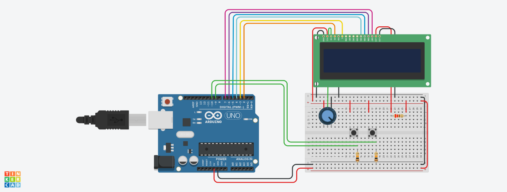

# CONFIGURACIÓN DE DISPOSITIVOS ELECTRÓNICOS
### **Cronometro LCD + pulsadores**

En la Figura 1 se muestra un cronómetro digital controlador con Arduino y visualización
con display 16x2. Para este sistema existen ciertas condiciones que deben cumplirse:

1. El cronómetro debe iniciarse al conectarse el arduino.

2. Debe tener un botón de pause, el cuál debe servir para reanudar el conteo.

3. Debe tener un botón de reset, el cuál debe borrar los datos que tenía el crnómetro hasta ese momento.

4. En el display se deben mostrar las décimas de segundo, los segundos, los minutos y las horas.

* Diseño del circuito:

    

* Explicación Codigo fuente:
    * importamos la libreria para utilizar el LCD y lo declaramos junto con sus pines.
        ```c++
        #include <LiquidCrystal.h>
        LiquidCrystal lcd(2,3,4,5,6,7);
        ```

    * Declaramos las varibles y los dos pulsadores que se van a utilizar.
        ```c++
        int horas = 0;
        int minutos = 0;
        int segundos = 0;
        int decimas = 0;
        long milisegundos = 0;
        
        int pulsadorReset = 10;
        int pulsadorPausa = 9; 
        ```
    
    *  En el void setup() inicializamos los pulsadores como entrada, luego iniciamos el LCD y mandamos a llamar a la función pintarPantalla().
        ```c++
        void setup() {
         Serial.begin(9600);
         pinMode(pulsadorReset, INPUT); 
         pinMode(pulsadorPausa, INPUT);
         lcd.begin(16,2);
         pintarPantalla();
        }
        ```

    * La función pintarPantalla() lo que haces es pintar en el LCD los indicativos de hora, minutos, segundos y decimas de segundos en la primera fila del LCD.
        ```c++
        void pintarPantalla(){
         lcd. setCursor(0, 0);
         lcd.print("h");
         lcd. setCursor(3, 0);
         lcd.print("m");
         lcd. setCursor(6, 0);
         lcd.print("s");
         lcd. setCursor(9, 0);
         lcd.print("ds");
        }
        ```

    * En el void loop() iniciamos con la logica del cronometro, primero tenemos un condicional que nos ayuda a comprobar si la lectura del pulsadorReset es igual a HIGH entonces va a colocar las varibles de hora, minutos, segundos y decimas de segundo en 0, limpiamos el LCD y se vuelve a llamar a la función pintarPantalla().
        ```c++
        if(digitalRead(pulsadorReset) == HIGH)
        {
            horas = 0;
            minutos = 0;
            segundos = 0;
            decimas = 0;
            lcd.clear();
            pintarPantalla();
        }
        ```
    
    * Nuveamente en el void loop tenemos otro condicional que se encargar de leer el valor del pulsadorPausa y si este es igual a HIGH se congela el tiemo hasta que lo volvamos a presionar.
        ```c++
        if(digitalRead(pulsadorPausa) == HIGH)
        {
          delay(100);
          while(digitalRead(pulsadorPausa) == LOW);
          delay(100);
        }
        ```
    * Por ultimo al final del void loop() mandamos a ejecutar a la función cronometro() la cual inicia llamando a la funcion millis() para sacar los milisegundos, luego preguntamos si los milisegundos transcurridos es mayor a una decima de segundo si es asi aumentamos la variable decimas en 1, ahi mismo preguntamos si las decimas de segundo son iguales a 10 entonces la variable decimas le asignamos cero y a la varible segundo la aumentamos en 1, posteriormente hacemos el condicional para determinar  si la varible segundos es igual a 60 entonces a esta misma le asignamos el valor de 0 y aumentamos en 1 la varible minutos para teminar los condicionales simplemente preguntamos si la varible minutos es igual a 60, si esto sucede la varible minutos volvera a 0 y a la varible horas le sumamos 1, para finalizar en la funcion cronometro() tambien pintamos los valores horas, minutos, segundos y decimas de segundos en el LCD.
        ```c++
        void cronometro(){
         milisegundos = millis();
    
         if(milisegundos % 100 == 0)
         {
          decimas++;
            if(decimas == 10)
            {
                decimas = 0;
                segundos++;
            }
            if(segundos == 60)
            {
                segundos = 0;
                minutos++;
            }
            if(minutos == 60)
            {
                minutos = 0;
                horas++;
            }
        
         lcd.setCursor(0,1);
         if(horas < 10)
         {
            lcd.print("0");
         }
         lcd.print(horas);
         lcd.print(":");
         lcd.setCursor(3,1);
         if(minutos < 10)
         {
            lcd.print("0");
         }
         lcd.print(minutos);
         lcd.print(":");
         lcd.setCursor(6,1);
         if(segundos < 10)
         {
            lcd.print("0");
         }
         lcd.print(segundos);
         lcd.print("(");
         lcd.setCursor(9,1);
         lcd.print(decimas);
         lcd.print(")");
         }    
        }
        ```

* Link de la simulación:

    [Link Simulation Here](https://www.tinkercad.com/things/eAGt0UWStpG)