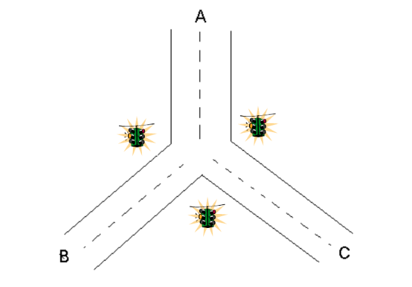
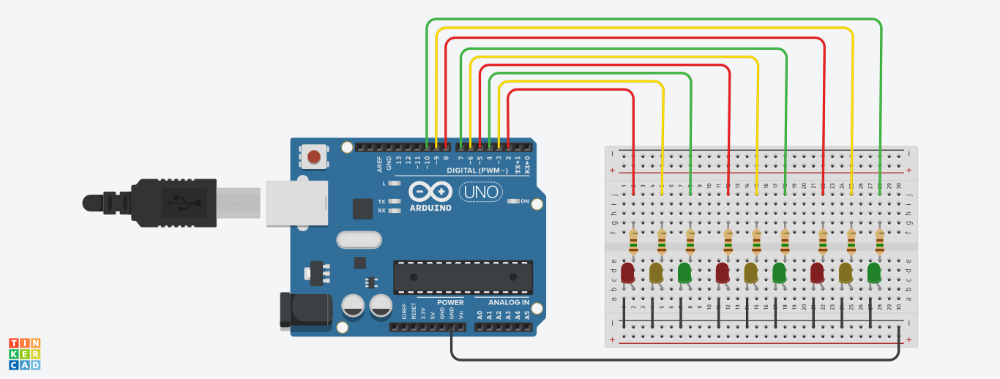

# CONFIGURACIÓN DE DISPOSITIVOS ELECTRÓNICOS
### **Control de un semáforo de tres vías**

En la Figura 1 se muestra una intersección de tres vías. El tráfico en cada una de las vías es controlado por un semáforo de tres luces (verde, roja y amarilla) que está diagonal a la intersección de cada vía (o sea enfrente de la bocacalle). Para este sistema de luces existen ciertas condiciones que deben cumplirse:

1. Nunca se deben activar 2 luces verdes al mismo tiempo.

2. Cada vía debe tener un tiempo de paso (luz verde activada) de 15 segundos.

3. La luz amarilla sólo se debe activar cuando se va a hacer el cambio de luz verde a roja (no es necesario activarla en el cambio de roja a verde).

4. Nunca se deben activar al mismo tiempo una luz verde y una amarilla (pude ocasionar accidentes).

5. Nunca se deben activara varias luces amarillas al mismo tiempo.

6. La duración de la luz amarilla debe ser máximo de 1 segundo (se recomienda 0,5 segundos).

    

* Diseño del circuito:

    

* Codigo fuente:

    [Link code Here](https://github.com/isaacv4071/ArduinoProjects/blob/main/packages/semaforo3vias/code/main.ino)

* Link de la simulación:

    [Link Simulation Here](https://www.tinkercad.com/things/6g6R8uzQU3D)